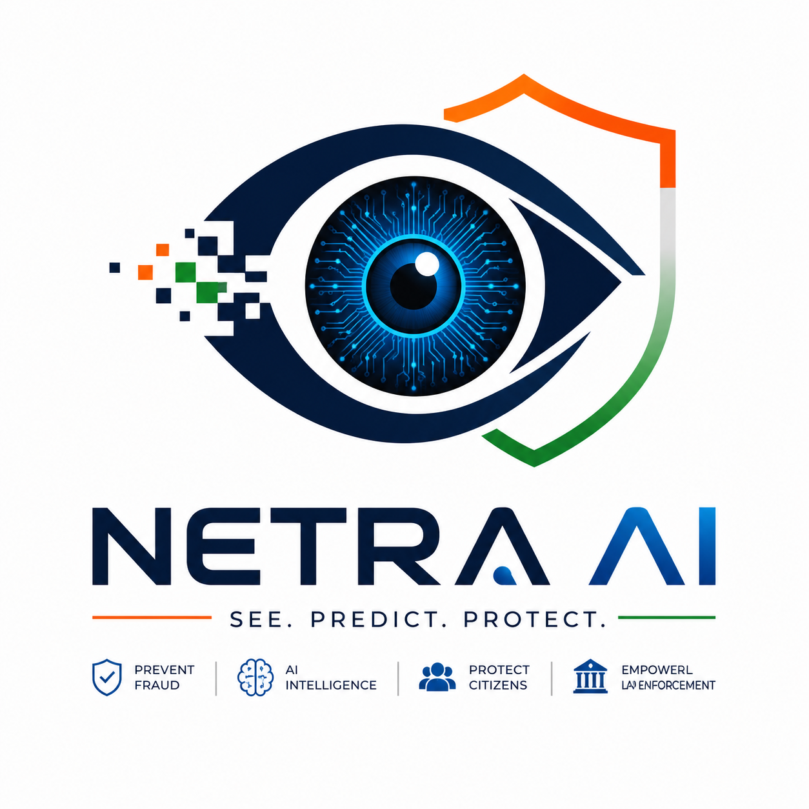

  

<h1 align="center">Netra AI</h1>

  AI-Powered Multilingual Fraud Risk Screening Platform

# Run and deploy your AI Studio app

This contains everything you need to run your app locally.

View Netra AI- https://netra-ai-dsxg.onrender.com

## Run Locally

**Prerequisites:**  Node.js

1. Install dependencies:
   `npm install`
2. Set the `GEMINI_API_KEY` in [.env.local](.env.local) to your Gemini API key
3. Run the app:
   `npm run dev`

# Netra AI

AI-powered multilingual fraud risk screening and citizen safety platform.

Netra AI helps users analyse suspicious calls, WhatsApp messages, and currency note images. The platform provides AI-assisted risk assessments, explains possible warning signs, and offers general cyber fraud reporting guidance.

## Features

- Suspicious Call Analysis
- WhatsApp Scam Screenshot Analysis
- Netra AI Currency Note Risk Screening
- Citizen Help Assistant
- Fraud News and Alerts
- English, Hindi and Marathi Support
- Explainable AI Risk Results

## Technology Stack

- React
- TypeScript
- Node.js
- Gemini API
- CSS
- Structured JSON

## Run Locally

### Prerequisites

- Node.js
- Gemini API Key

🚀 This project was developed as part of the ET AI Hackathon 2.0. Netra AI is an AI-powered multilingual fraud risk screening platform designed to improve citizen safety by helping users analyze suspicious calls, WhatsApp messages, and currency notes. Through explainable AI, multilingual support, and cyber awareness features, the project demonstrates how AI can empower users to identify potential fraud risks and respond with greater confidence.

> Note: The prototype is hosted on a free development server. Initial loading may take up to 60 seconds if the server is inactive.
